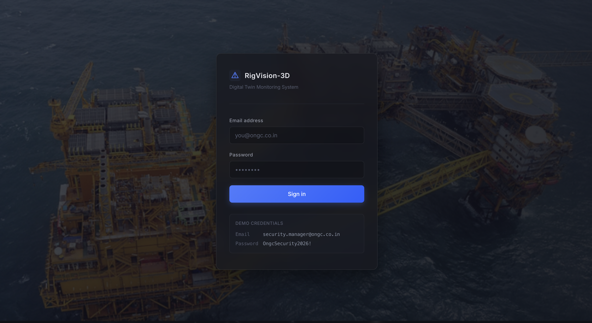
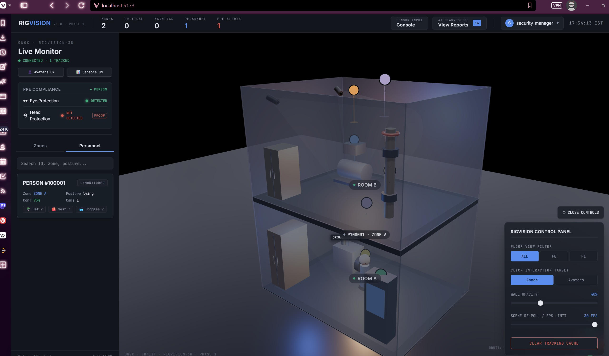
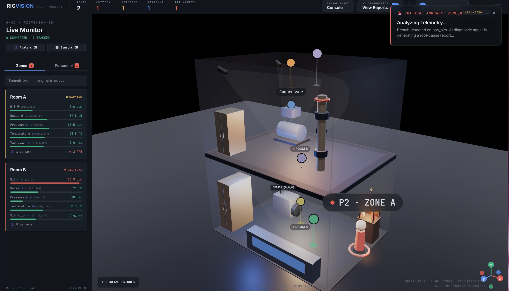
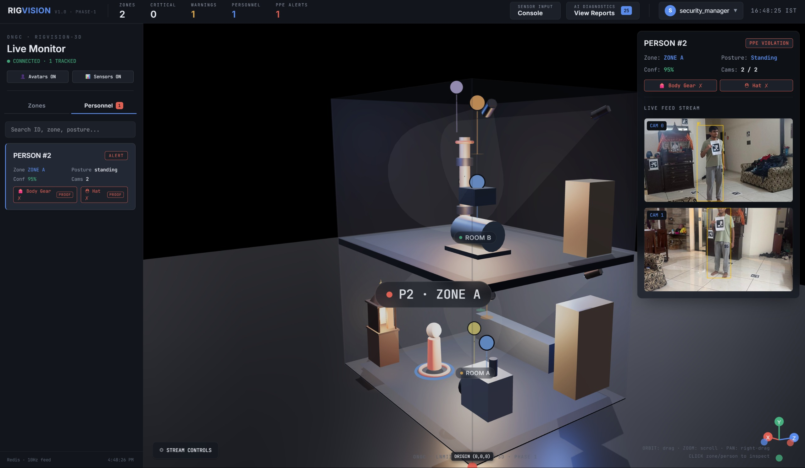
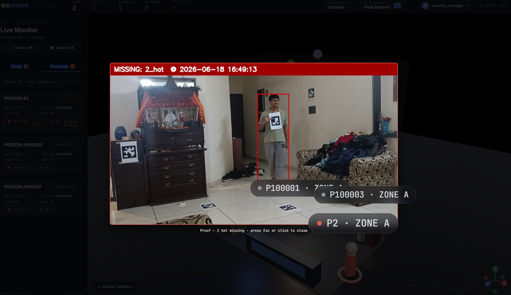
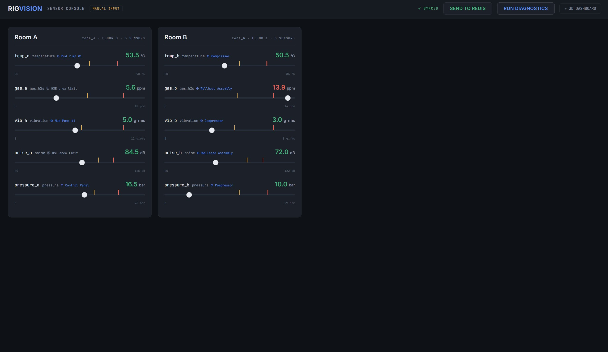
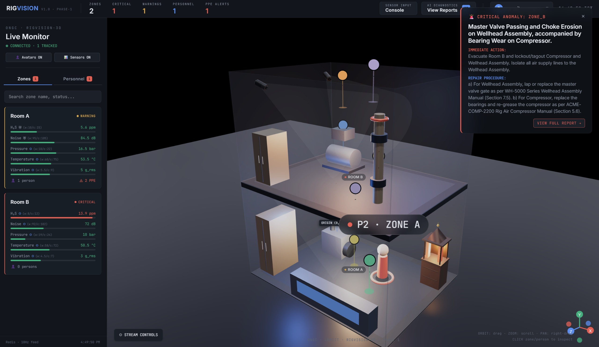
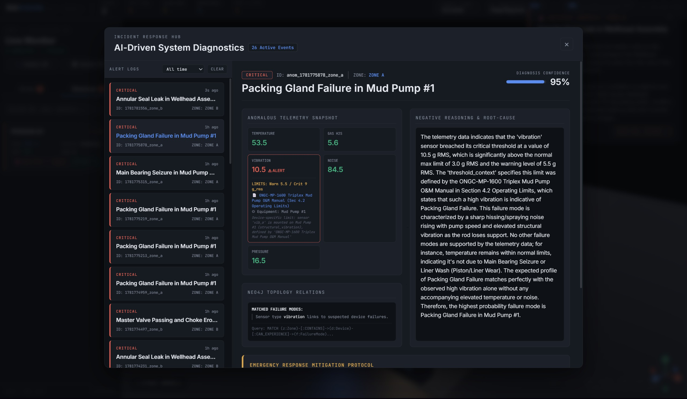

# RigVision-3D

A 3D dashboard for monitoring an ONGC drilling rig from a browser. The site shows the rig as an interactive 3D model and overlays it with live camera feeds, sensor readings, and safety alerts.

---

## Why we built this

Drilling rigs are noisy, hazardous places. A control-room operator usually has to watch many separate screens CCTV grids, sensor charts, PPE compliance logs to know what's happening.

RigVision-3D puts all of that into a single 3D view of the rig itself. The operator sees the rig, the people inside it, and the sensor status in one place. If something goes wrong, the system explains *what* is wrong and *what to do about it* in plain language.

---

## What it does

**3D view of the rig.** The whole rig is modelled in the browser using Three.js. The operator can orbit around it, walk through it, or look at it from the top. Each room is a colored zone green when normal, amber when something is concerning, red when it's serious.

**Live person tracking.** Four cameras (two per room) watch the rig. The system detects workers, follows them across cameras, and shows each one as an avatar standing in the correct spot in the 3D model.

**PPE detection.** For every worker on screen, the system checks whether they're wearing a hard hat, safety vest, and goggles. Missing gear shows up immediately in the side panel.

**Sensor monitoring.** Each room has temperature, vibration, noise, gas (H₂S), and pressure sensors. Their current values colour the room and feed a separate Sensor Console (a second page where you can also push test values).

**AI reasoning for anomalies.** When a reading goes out of range, the operator can click "Run Diagnostics". The system looks up the relevant equipment manual, queries a knowledge graph for related failure modes, and passes everything to a local LLM. The LLM replies with a short explanation: likely cause, suggested action, and a confidence score.

---

## Architecture

[View the full pipeline diagram →](https://excalidraw.com/#json=0n3xeZB19GUJ1IpRqmND1,v6buYu_nCWh8VcsiWxy-Eg)


---

## Screenshots

### 1. Login



*The entry point. Authentication is handled by the Express + MongoDB service in `auth-rig/`, which issues a JWT cookie. Demo credentials are shown for evaluators.*

### 2. Live Monitor (Main View)



*After signing in, the operator lands on the 3D dashboard. The rig sits in the centre, the left panel shows the tracked person's details and PPE status, and the right panel exposes scene controls floor filter, wall opacity, and click targets.*

### 3. Zones view (sensor status per room)



*Switching the left panel to "Zones" lists each room's live sensor values (H₂S, noise, pressure, temperature, vibration) with their warning and critical thresholds. Status colours follow the values in real time.*

### 4. Personnel view (live camera feeds)



*Clicking a person opens their detail card on the right with both camera feeds. YOLO bounding boxes are drawn around the worker in each feed, and the ArUco markers visible on the floor and walls are what anchor the cameras to the real room coordinates.*

### 5. PPE proof snapshot



*Clicking "Proof" on a PPE violation opens the exact frame the system flagged. The red bounding box marks the person who triggered the alert, with the missing item (here, "2_hat") and the timestamp in the header.*

### 6. Sensor Console



*The standalone Sensor Console runs on port 5174. Each slider drives one sensor's value; "Send to Redis" commits the change, and "Run Diagnostics" triggers the AI pipeline against the current readings. Used for testing without real hardware.*

### 7. AI diagnostics Pop Up



*Once a zone goes critical, the LLM produces a short root-cause report — a diagnosis, immediate action steps, and a repair procedure that cites the exact equipment manual section. The summary appears as a toast and the full report opens in a modal.*

### 8. Incident Response Hub (full diagnostics history)



*The full diagnostics dashboard. The left rail lists every alert the system has generated. Selecting one opens the full report — the anomalous sensor snapshot, the Neo4j query that pulled related failure modes, and the LLM's reasoning that arrived at the diagnosis with a confidence score.*

---

## Tech stack

**Frontend (Dashboard + Sensor Console)**
React 19, Vite, TailwindCSS, React Router, Zustand
Three.js, @react-three/fiber, @react-three/drei
Recharts

**Backend API**
FastAPI, Uvicorn, Pydantic, Python 3.11

**Authentication**
Node.js, Express, MongoDB, JWT, bcrypt

**Computer vision**
YOLOv8 (Ultralytics), PyTorch + CUDA
BoT-SORT tracker (Kalman)
OpenCV for calibration, ArUco markers, triangulation

**Sensor + diagnostics**
Redis (live state), Apache Kafka (alerts bus)
PostgreSQL + TimescaleDB (history)
Neo4j (knowledge graph), ChromaDB (vector search)
Google Gemini (embeddings), LM Studio (local LLM for answers)

**Infrastructure**
Docker Compose for Redis, Postgres, Neo4j, Kafka, ChromaDB, MongoDB

---

## Running it locally

You'll need Docker, Python 3.11, Node.js 20, and LM Studio (for the local LLM).
An NVIDIA GPU is recommended for live camera mode, demo mode runs on CPU.

**1. Clone and set up environment variables**

```bash
git clone https://github.com/satvikdua06-dev/RigVision.git RigVision
cd RigVision
```

You must configure **two** `.env` files for the system to run correctly:

**Global Backend/CV `.env`** (Root directory)
Copy the example file:
```bash
cp .env.example .env
```
Ensure you fill in your Gemini API key or LM Studio model name.

**Auth Service `.env`** (`auth-rig/` directory)
Create `auth-rig/.env` and add the MongoDB URI and ensure the port is set to `5001` to avoid macOS AirPlay conflicts:
```env
NODE_ENV=development
PORT=5001
MONGO_URI=mongodb://127.0.0.1:27017/auth_rig
JWT_SECRET=your_super_secret_key_here
JWT_EXPIRE=30d
SECURITY_MANAGER_USERNAME=security_manager
SECURITY_MANAGER_EMAIL=security.manager@ongc.co.in
SECURITY_MANAGER_PASSWORD=OngcSecurity2026!
```

*(Optional: If you use Port 5001 for auth, create `frontend/.env.local` containing `VITE_AUTH_API=http://localhost:5001/api/auth`)*

**2. Start the infrastructure**

```bash
docker compose up -d
```
This brings up Redis, PostgreSQL, Neo4j, Kafka, MongoDB, and ChromaDB.

**3. Install Dependencies (Global Setup)**

Use the built-in Makefile command to install all Python and Node.js dependencies across the project:
```bash
make install
```

**4. Seed the Graph Database**

For a fresh install, seed the Neo4j knowledge graph:
```bash
python knowledge/graph/seed_graph.py
```

**5. Start the Entire Project (One-Click)**

Instead of opening 6 different terminals, RigVision-3D uses a multiplexer script that handles all background processes, automatically detects your virtual environments, and color-codes all logs into a single window:

```bash
python3 start_project.py
```

**6. Open the Dashboard**

Go to `http://localhost:5173`, sign in using the Security Manager credentials from your `.env`, and you should see the 3D rig!
